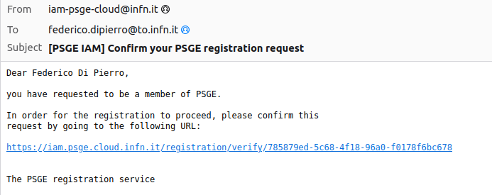
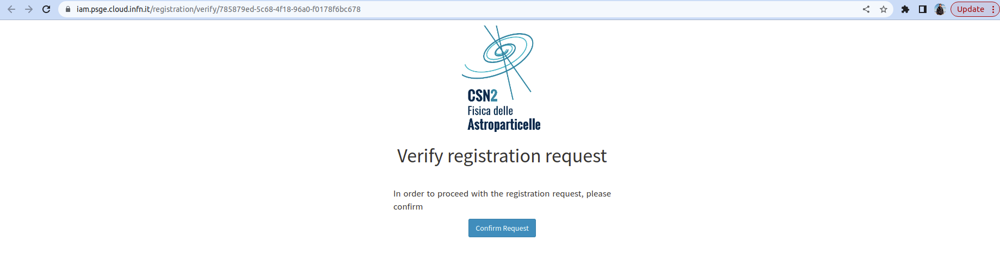
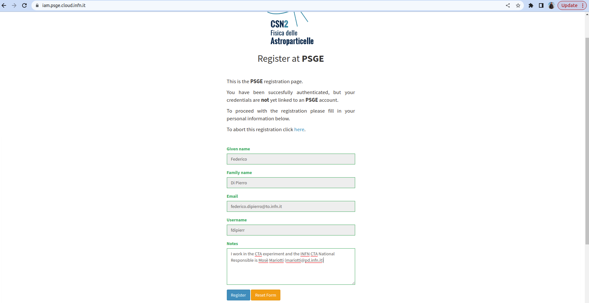

# PSGE IAM Registration and Login Guide

This guide will help you register and log into the PSGE IAM service available at [https://iam.psge.cloud.infn.it](https://iam.psge.cloud.infn.it).

---

## 1. Login to PSGE IAM

Navigate to: [https://iam.psge.cloud.infn.it/login](https://iam.psge.cloud.infn.it/login)

Click on the **INFN** login button to authenticate using your INFN AAI credentials.

---

## 2. Fill in the Registration Form

After successful authentication, you will be redirected to the PSGE registration form. 

Fill in all the required fields:
- **Given name**
- **Family name**
- **Email**
- **Username**
- **Notes** (e.g., your experiment involvement and national contact person)

Click **Register** to proceed.

---

## 3. Email Confirmation

You will receive an email from the PSGE IAM service. 

Open the email and click on the confirmation link provided to verify your registration request.

---

## 4. Verify Registration Request

The link will take you to a page asking you to confirm your registration.

Click **Confirm Request** to continue.

---

## 5. Registration Submitted

After confirming, you will see a message stating that your request has been **submitted successfully**.

An email confirmation has been sent and the request is now awaiting administrator approval.

---

## 6. Request Confirmed

Once the system confirms your submission, you’ll see a **Request confirmed successfully** message.

You will be notified via email once your request is approved by an administrator.

---

## ✅ Next Steps

Once approved, return to [https://iam.psge.cloud.infn.it/login](https://iam.psge.cloud.infn.it/login) and use the **INFN** button to log in to the platform.

If you encounter any issues, please contact your local PSGE IAM administrator.
