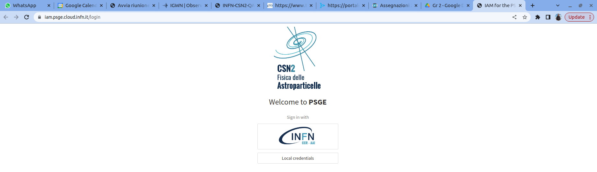
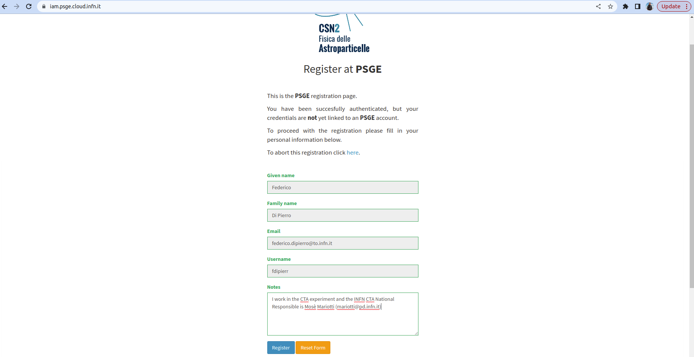
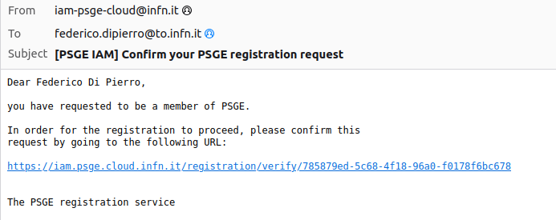

# PSGE IAM Registration and Login Guide

This guide will help you register and log into the PSGE IAM service available at [https://iam.psge.cloud.infn.it](https://iam.psge.cloud.infn.it).

<!-- 
* if you are not associeted/hosted/employed of INFN plese, before next steps, plse signup on: https://signup.app.infn.it/ 
  * accept the security policy  https://userportal.app.infn.it/ (for foreign users no CODICE FISCALE (CF) is needed);
  * follow the traning on computing security;
  * goto haed with the registration in the PSGE IAM (step 1)
-->
---

## 0. Requirements: Signup for Computing Resources  
*(Required for all resources: CLOUD, LNGS, LNF)*

### Case 1: You already have an INFN **username**
- Proceed directly to **Step 1**  
  👉 See the [INFN Cloud Guide](https://guides.cloud.infn.it/docs/users-guides/en/latest/users_guides/getting_started/getting_started.html)
- When submitting the request, specify in the **Notes** field that you want to be part of the **EXPERIMENT** group.

---

### Case 2: You are **not associated / hosted / employed by INFN**
1. Register at:  
   👉 https://signup.app.infn.it/
2. Follow the registration guide:  
   👉 [Registration to INFN (PDF)](https://github.com/CYGNUS-RD/cygno/blob/main/Registration%20to%20INFN.pdf)  
   *(Tips for foreign users are included in the guide.)*
3. During registration:
   - Accept the security policy at  
     👉 https://userportal.app.infn.it/  
     *(For foreign users, a **Codice Fiscale (CF)** is **not required**.)*
   - Complete the **computing security training**.
4. Register in the **CYGNO Cloud IAM** as a **user**:  
   👉 https://iam-cygno.cloud.cnaf.infn.it/  
   - Follow the [INFN Cloud Guide](https://guides.cloud.infn.it/docs/users-guides/en/latest/users_guides/getting_started/getting_started.html)
   - In the **Notes** field, specify that you want to be part of the **cygno-user** group.

---

### Problems with INFN Username
- If you **do not receive an INFN username**, or
- If you encounter an error related to the username (e.g. the one shown below),

📩 **Please contact Giovanni Mazzitelli**.

## 1. Login to PSGE IAM

Navigate to: [https://iam.psge.cloud.infn.it/login](https://iam.psge.cloud.infn.it/login)

Click on the **INFN** login button to authenticate using your INFN AAI credentials.

---

## 2. Fill in the Registration Form

After successful authentication, you will be redirected to the PSGE registration form. 

Fill in all the required fields:
- **Given name**
- **Family name**
- **Email**
- **Username**
- **Notes** (specify your experiment CSN2 group and national contact person)

Click **Register** to proceed.

---

## 3. Registration Submitted

After confirming, you will see a message stating that your request has been **submitted successfully**.

---

## 3. Email Confirmation

You will receive an email from the PSGE IAM service. 

Open the email and click on the confirmation link provided to verify your registration request.

An email confirmation has been sent and the request is now awaiting administrator approval.

---

## 4. Verify Registration Request

The link will take you to a page asking you to confirm your registration.

Click **Confirm Request** to continue.

Once the system confirms your submission, you’ll see a **Request confirmed successfully** message.

You will be notified via email once your request is approved by an administrator.

---

## ✅ Next Steps

Once approved, return to [https://iam.psge.cloud.infn.it/login](https://iam.psge.cloud.infn.it/login) and use the **INFN** button to log in to the platform.

If you encounter any issues, please contact your local PSGE IAM administrator.
