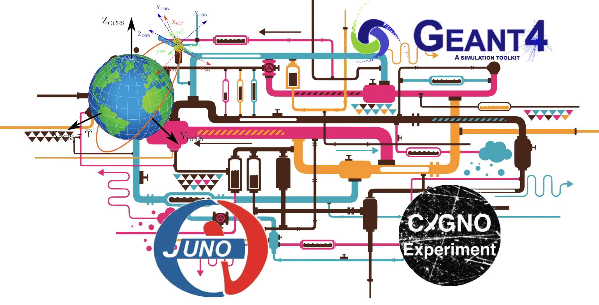
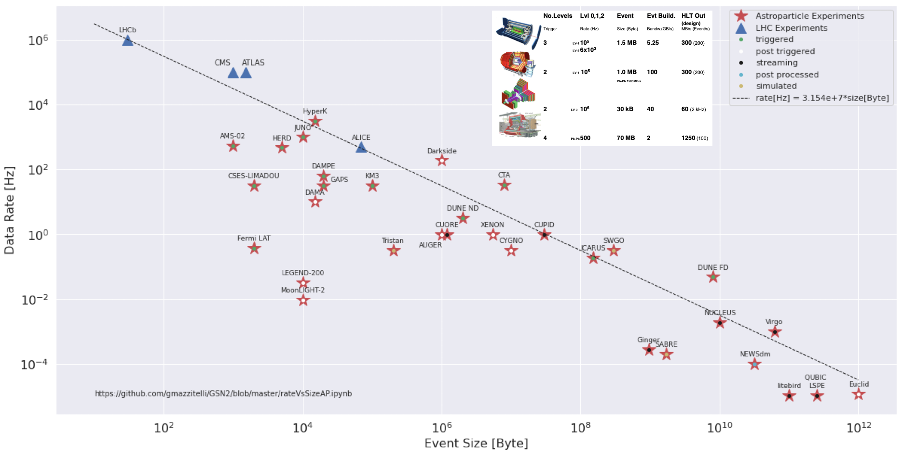

### Pipeline optimization for space and ground based experiments (PSGE)

The **Pipeline optimization for space and ground based experiments** (PSGE) flagship UC of the Spoke 2 aims at collecting the requirements of four different subtasks into a common framework based on the exploitation of opportunistic resources offered by the ICSC Cloud or HPC infrastructures. The PSGE flagship project will analyze the single applications and identify common issues and solutions to be implemented in a single framework

<table align="center">
  <tr>
    <th border-style: none;></th>
    <th border-style: none;></th>
    <th border-style: none;></th>
  </tr>
</table>

The pipelines to be optimized are summarized in the following: 

1) Pipeline for space gravity missions: the main objective is the development of methodologies and expertise for the development, optimization and management of pipelines for precise orbit determination (POD) of Earth-orbiting satellites. The pipeline should make up an interface layer between the core POD code (assumed already existent and properly working) and the user / other analysis code / archive. A specific reference case is given by a widely used POD code written in Fortran 77/90 and essentially monolithic in its structure and used for research in geodesy, geophysics and fundamental physics (e.g., general relativity tests) \[10-12\]. An existing ensemble of interface codes (written in Bash and Python) would constitute the core for an analysis package able to manage complex analysis tasks (including Monte Carlo simulations), handle data and metadata, and manage archives. Due attention is foreseen to virtualization/containers (e.g. Docker). Contact person: Roberto Peron (INAF)  
2) Pipeline for JUNO and similar experiments: JUNO analysis has the problem to extract neutrino information from a variety of sources (reactors anti neutrino, solar neutrinos, atmospheric neutrinos, geo neutrinos and cosmological neutrinos at least) and energy ranges from a large background. This make the problem quite computationally intensive. JUNO made large use of GEANT4, integrated with others in JUNOSW, JUNO software environment \[7\]. Work is already in progress to have JUNOSW using multithreading and to integrate nVidia Optix to use GPU to propagate optical photons in Geant4 \[6\]. To further increase performances the goal is to investigate a technique to introduce limited parallelism both in Geant4 and JUNOSW insisting on a specific feature already present in the SW. Contact Person: Giuseppe Andronico (INFN)  
3) Pipeline for CYGNO\[8\] and small/medium experiments in the astroparticle physics community: CYGNO, like many other astroparticle experiments, requires a computing model to acquire, store, simulate and analyze data typically far from High Energy Physics (HEP) experiments. Indeed, astroparticle experiments are typically characterized by the fact to be less demanding from computing resources with respect to HEP one but have to deal with unique and unrepeatable data, sometimes collected in extreme conditions, with extensive use of templates and Montecarlo, and are often re-calibrated and reconstructed many times for a given data sets.   

<table align="center">
  <tr>
    <th border-style: none;>
    </th>
  </tr>
  <tr>
    <th border-style: none;> <i> Results of the survey on the Italian astro-particle community about the characteristics of their computing model: experiments are characterized by having a different throughput respect to typical HEP experiments, anyhow following a scaling law that underline how are anyway demanding in the overall process https://doi.org/10.1051/epjconf/202429507013</i>
    </th>
  </tr>
</table>

   Moreover, the varieties and the scale of computing models and requirements are extremely large. In this scenario, the Cloud infrastructure with standardized and optimized services offered to the scientific community could be a useful solution able to match the requirements of many small/medium size experiments. Starting from the  CYGNO computing model\[9\] based on the INFN cloud infrastructure, aiming at extending the experiment software, to similar experiments  and similar applications providing tools as a service to store, archive, analyze, and simulate data.  
   Contact person: Giovanni Mazzitelli (INFN)  
4) Pipeline for GEANT4 simulations in HPC environments, with the simulation of the NASA COSI Anti-Coincidence System (ACS) as a test case: the future progress in the observation of the Universe at high energies (X-rays, Gamma-rays) is strictly connected to the development of new technologies in remote ground-based experiments or in space exposed to potential radiation hazards. Monte Carlo simulations based on the Geant4 toolkit library \[2, 3, 4\] for particle transport represent a key tool for the design, verification, calibration of the instruments and development of the data analysis software for the majority of experiments and telescopes for Astro-Particle and Astrophysics (e.g. Athena, COSI, THESEUS). As the complexity of new technology for science exploration increases, Geant4 simulations require the implementation of advanced geometries and physics models and results with higher statistical accuracy. The consequent increase in the computational time, data volumes of the simulation output and the I/O transfers translate into higher demands in computational and storage resources. The goal of the project is applying new methodologies for multi-threading and multi-node computation in a pipeline for Geant4 multi-purpose simulations in HPC architectures while exploring new I/O interfaces (e.g. CAD geometries, databases). The pipeline will use the Bologna Geant4 Multi-Mission Simulator (BoGEMMS \[5\]) as baseline simulation framework to validate the results and as starting point for the implementation of new HPC-oriented features. The proposing group has more than 10 years of experience in the development and validation of Geant4 simulation codes and pipelines, both as direct contributions in international collaborations (e.g. Athena)  or in projects funded by the European Union (HORIZON2020) or the European Space Agency (e.g. AREMBES, EXACRAD). Contact person: Valentina Fioretti (INAF)

The project starts with the identification of the requirements related to a pipeline prototype.  It will be  followed by the design of common tools for the containerization, data and metadata management, pipeline communications and software repository based on the ICSC Cloud infrastructure or HPC architectures. The activity will be pursued in collaboration with WP4 and 5, devoted to technology and computing models evolution, and WP6 for the optimization and adaptation of widely used software (e.g. Geant4). This requires inter work package meetings, access to the infrastructure and access to a set of minimal resources to develop and test tools for data and metadata management and for data analysis and simulation.   
Finally, the implementation of one or more pipeline prototypes for data, metadata, simulations and analysis will follow, offering a framework in the context of the Flagship UC but generalizable to future applications. The software developed will be available and documented on a public git repository. 

The Flagship UC goals are:

* Collecting the requirements and efforts of four subtasks into pipeline frameworks for data simulation and analysis based on a selected ICSC infrastructure (e.g. data clouds, HPC);  
* Reviewing the state-of-the-art of the available open-source software and free-access environments for the design of a prototype;    
* Building pipeline prototypes, which includes the definition of the technological solutions for the containerization, data and metadata management, pipeline tools and software repository and the selection of the target infrastructure (e.g. the INFN Cloud infrastructure). This activity will be performed in collaboration with WP 4 and 5\.

References   
\[1\] Penzias, A.A. & Wilson, R.W., “A Measurement of Excess Antenna Temperature at 4080 Mc/s.”, ApJ, 142, 419 (1965)  
\[2\] Agostinelli, S., Allison, J., Amako, K., et al. “Geant4—a simulation toolkit”, NIMPA, 506, 250 (2003)   
\[3\] Allison, J., Amako, K., Apostolakis, J., et al., “Geant4 developments and applications”, ITNS, 53, 270 (2006)   
\[4\] Allison, J., Amako, K., Apostolakis, J., et al., “Recent developments in GEANT4”, NIMPA, 835, 186 (2016)   
\[5\] Fioretti, V., Bulgarelli, A., Tavani, M., et al., “Monte Carlo simulations of gamma-ray space telescopes: a BoGEMMS multi-purpose application”, Proc. SPIE, 91443N (2014)  
\[6\] Blyth, imon C, “Opticks : GPU Optical Photon Simulation for Particle Physics using NVIDIA® OptiX™”, J.Phys.Conf.Ser., 898, 4 (2017)  
\[7\] Lin, T., Li W., et al., “ The Application of SNiPER to the JUNO Simulation”, J. Phys.: Conf. Ser., 898, 4 (2017)  
\[8\] Amaro, F., et al. The CYGNO Experiment. Instruments. 6 (2022), [https://doi.org/10.3390/instruments6010006](https://doi.org/10.3390/instruments6010006)  
\[9\] Amaro, F., et al. Exploiting INFN-Cloud to implement a Cloud solution to support the CYGNO computing model. [https://doi.org/10.22323/1.415.0021](https://doi.org/10.22323/1.415.0021)  
\[10\] Lucchesi, D.M., Peron, R., Accurate Measurement in the Field of the Earth of the General-Relativistic Precession of the LAGEOS II Pericenter and New Constraints on Non-Newtonian Gravity, Phys. Rev. Lett. 105, 231103 (2010), doi:10.1103/PhysRevLett.105.231103, arXiv:1106.2905  
\[11\] Lucchesi, D.M., Peron, R., The LAGEOS II pericenter general relativistic precession (1993–2005): error budget and constraints in gravitational physics, Phys. Rev. D 89, 082002 (2014), doi:10.1103/PhysRevD.89.082002  
\[12\] Peron, R., Lorenzini, E.C., METRIC: a dedicated Earth-orbiting spacecraft for investigating gravitational physics and the space environment, Aerospace 4, 38 (2017), doi:10.3390/aerospace4030038

## *Participating Institutions* 

* Leader: GiovanniMazzitelli (INFN)  
* Participants:     INFN, INAF   
* External collaborators: Gorgio Dho (INFN), I. A. Costa (INFN)  
